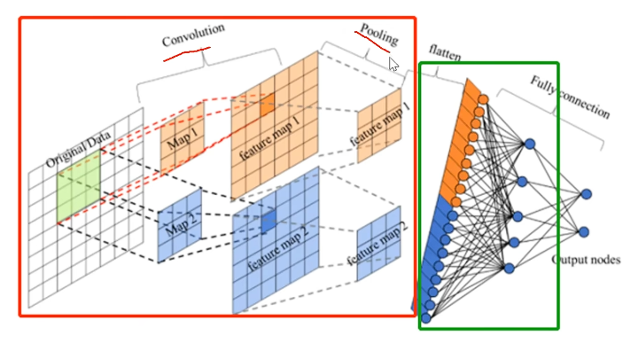

## Convolutional Neural Network（CNN）

### Convolutional
- 含义：卷+积

### Convolutional kernel
- 作用：
  - 找特征 
- 参数共享——一次卷积中参数不变
  - translation invariance 

### feature map
- 含义：卷积之后得到的矩阵

### padding
- 操作：在边缘周围补充0
- 意义：
  - 公平——让模型可以关注到边缘信息
  - 可以调整feature map的尺寸
### stride
- 含义：一次移动的距离

### 感受野
- 特征图上一个像素对应原图的区域小

### pooling
- 分类
  - 平均池化
  - 最大池化（我感觉像求极值）
- 意义：在保留关键信息的条件下降维

### flatten
- 降维变成向量给模型

### design-principle
- 参数量更少（比神经网络）
- 局部相关性：没必要关注全局
- 多层卷积可以提取更大像素的特征

### 我的question
- 卷积核的个数怎么确定
  - 超参数