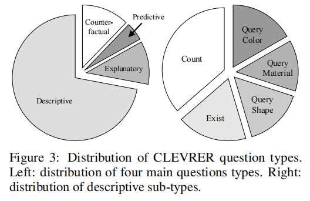
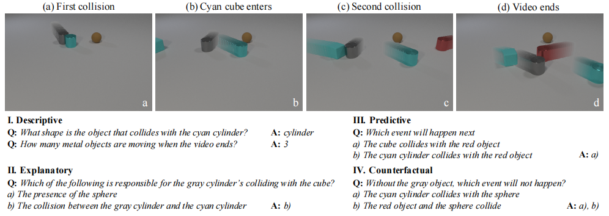
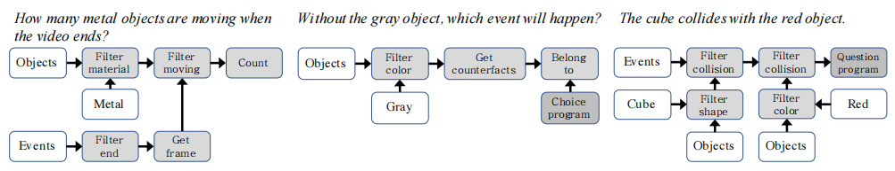
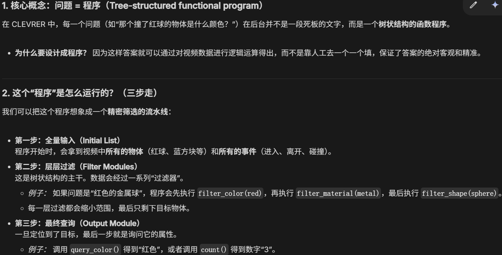
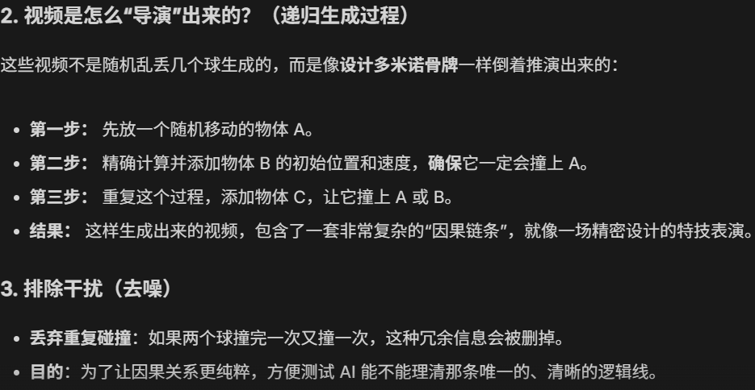

## benchmark

### 数据集构成
#### 构成
- 真实运动轨迹
- 历史事件记录

#### 参数
- 10000条用于训练、5000条验证、5000条测试
- 时长为5秒
- 物理引擎生成
- 所有物体size相同（不会垂直弹跳）

#### 关注点
- 时序和因果的逻辑推导
- 保持简介：减少对视觉场景和语言的偏见

### 评分构成
- 219918个描述性问题（如“是什么颜色”）

- 33811个解释性问题（“是什么导致了……”）
- 14298个预测性问题（“接下来会发生什么”）
- 37253个反事实性问题（“如果把这个移除……会怎样”）

### 诊断模型任务表现的程序

### 提出新模型NS-DR

### 我感觉的亮点

