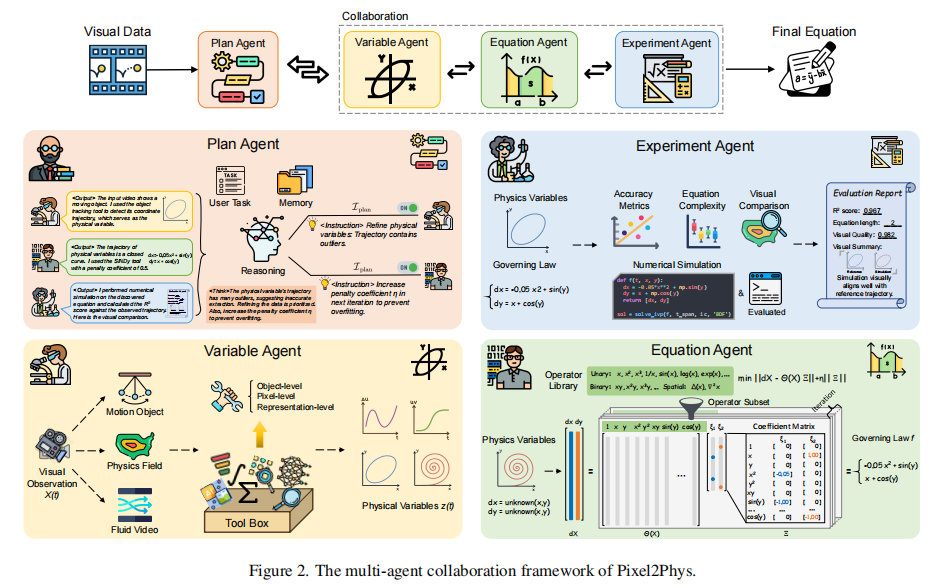

## 背景：CVPR
AI for science 自主推到物理公式 可解释性

## 问题
- 变量提取难： 视频噪声多
- 循环依赖问题： 公式依赖变量，变量依赖公式

## 解决方法
范式：多agent协作 + 迭代
- Plan Agent
- Variable Agent：多粒度
- Equation Agent：SINDy（非线性动力学稀疏识别）
- Experiment Agent

## 收获
范式：多agent协作 + 迭代
建模+自动化实验
